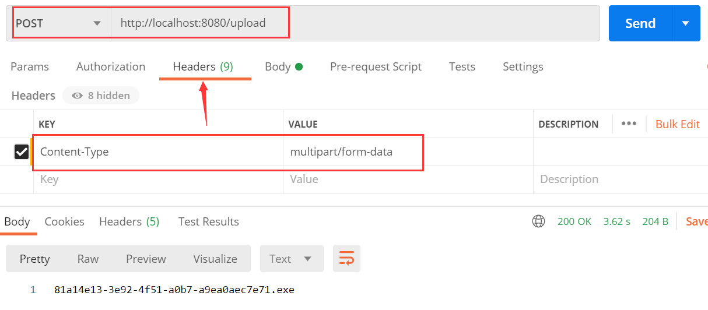
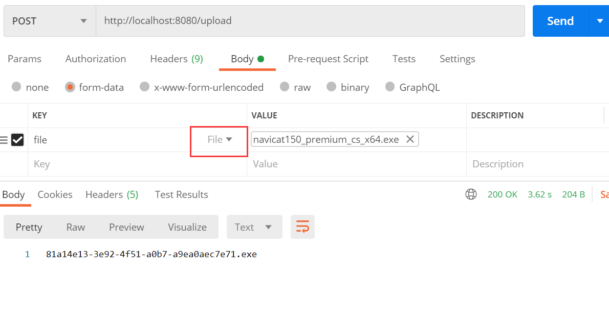
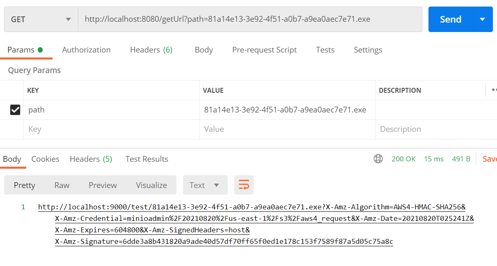
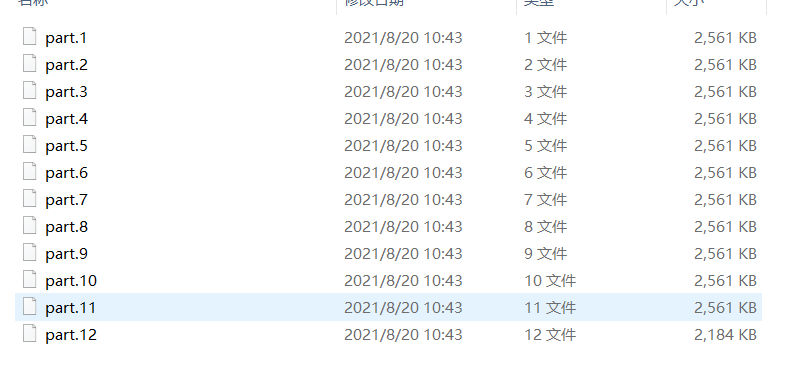

### 一、什么是MinIO？
一句话：MinIO是高性能、可扩展、云原生支持、操作简单、开源的分布式对象存储产品。

你可以把它和FastDFS、HDFS作为类比，但它比其它都更简单，极简是MinIO的设计初衷之一，而且他的性能很好。

当然也有很多商用的对象存储服务，如阿里的OSS、腾讯的COS，无需自己维护，但需要付费。自建对象存储还是香。

官网上的一句话：*在中国：阿里巴巴、腾讯、百度、中国联通、华为、中国移动等等9000多家企业也都在使用MinIO产品*


官网：[http://www.minio.org.cn/](http://www.minio.org.cn//)
### 二、如何安装部署？
下载地址：[http://www.minio.org.cn/download.shtml](http://www.minio.org.cn/download.shtml)


启动命令

```
# windows
minio.exe server http://127.0.0.1/E:/person/article-tools/minio/data0 http://127.0.0.1/E:/person/article-tools/minio/data1 http://127.0.0.1/E:/person/article-tools/minio/data2 http://127.0.0.1/E:/person/article-tools/minio/data3
```
- 这里面指定了4个分区(至少4个)，具体可以根据您的实际情况进行配置。可以四台主机各一个数据存放位置，也可以两台主机各两个存放位置。我这边是四个存放位置都在一台主机上。
- 格式是 ip + 存放位置，如  `http://127.0.0.1/E:/person/article-tools/minio/data0`中`http://127.0.0.1/`为ip地址，`E:/person/article-tools/minio/data0`为存放位置。

启动成功后 默认访问地址 [http://127.0.0.1:9000/](http://127.0.0.1:9000/)，默认账号和密码都是：`minioadmin`,创建一个`test`的桶(bucket)。
### 三、SpringBoot 集成 MinIO
`pom.xml`如下

```xml
<?xml version="1.0" encoding="UTF-8"?>
<project xmlns="http://maven.apache.org/POM/4.0.0" xmlns:xsi="http://www.w3.org/2001/XMLSchema-instance"
         xsi:schemaLocation="http://maven.apache.org/POM/4.0.0 https://maven.apache.org/xsd/maven-4.0.0.xsd">
    <parent>
        <groupId>org.springframework.boot</groupId>
        <artifactId>spring-boot-starter-parent</artifactId>
        <version>2.3.2.RELEASE</version>
        <relativePath/>
    </parent>

    <modelVersion>4.0.0</modelVersion>
    <groupId>com.llh.minio</groupId>
    <artifactId>minio-demo</artifactId>
    <version>1.0.0</version>
    <name>minio-demo</name>
    <description>minio-demo</description>

    <properties>
        <java.version>1.8</java.version>
        <project.build.sourceEncoding>UTF-8</project.build.sourceEncoding>
        <project.reporting.outputEncoding>UTF-8</project.reporting.outputEncoding>
        <spring-boot.version>2.3.7.RELEASE</spring-boot.version>
    </properties>

    <dependencies>
        <dependency>
            <groupId>io.minio</groupId>
            <artifactId>minio</artifactId>
            <version>8.2.2</version>
        </dependency>

        <dependency>
            <groupId>org.springframework.boot</groupId>
            <artifactId>spring-boot-starter-web</artifactId>
        </dependency>

        <dependency>
            <groupId>org.projectlombok</groupId>
            <artifactId>lombok</artifactId>
            <version>1.18.20</version>
            <scope>provided</scope>
        </dependency>

    </dependencies>

</project>

```
---

`MinioConfiguration`类

```java
package com.llh.minio.config;

import io.minio.MinioClient;
import org.springframework.context.annotation.Bean;
import org.springframework.context.annotation.Configuration;

@Configuration
public class MinioConfiguration {

    private static final String END_POINT = "http://localhost:9000";

    private static final String USERNAME = "minioadmin";

    private static final String PASSWORD = "minioadmin";

    @Bean
    public MinioClient minioClient() {
        return new MinioClient.Builder()
                .endpoint(END_POINT)
                .credentials(USERNAME, PASSWORD)
                .build();
    }
}
```
- 这里就是配置端口、用户名、密码，注入`MinioClient`
---

`TestController`类

```java
package com.llh.minio.controller;

import io.minio.GetPresignedObjectUrlArgs;
import io.minio.MinioClient;
import io.minio.PutObjectArgs;
import io.minio.http.Method;
import org.springframework.web.bind.annotation.GetMapping;
import org.springframework.web.bind.annotation.PostMapping;
import org.springframework.web.bind.annotation.RequestParam;
import org.springframework.web.bind.annotation.RestController;
import org.springframework.web.multipart.MultipartFile;

import javax.annotation.Resource;
import java.util.Objects;
import java.util.UUID;
import java.util.concurrent.TimeUnit;

@RestController
public class TestController {
    @Resource
    private MinioClient minioClient;

    // 和后台桶名对应
    private static final String TEST_BUCKET = "test";

    @PostMapping("upload")
    public String upload(@RequestParam(name = "file") MultipartFile file) {
        try {
            int idx = Objects.requireNonNull(file.getOriginalFilename()).lastIndexOf(".");
            String suffix = file.getOriginalFilename().substring(idx + 1);
            String fileName = UUID.randomUUID() + "." + suffix;

            // 保存文件
            minioClient.putObject(PutObjectArgs.builder()
                    .stream(file.getInputStream(), file.getSize(), PutObjectArgs.MIN_MULTIPART_SIZE)
                    .object(fileName)
                    .contentType(file.getContentType())
                    .bucket(TEST_BUCKET)
                    .build());
            return fileName;
        } catch (Exception e) {
            e.printStackTrace();
            return "";
        }
    }

    @GetMapping("getUrl")
    public String getUrl(@RequestParam(name = "path") String path) {
        try {
            // 获取文件访问地址 7天失效
            String url = minioClient.getPresignedObjectUrl(GetPresignedObjectUrlArgs.builder()
                    .bucket(TEST_BUCKET)
                    .object(path).
                    method(Method.GET)
                    .expiry(7, TimeUnit.DAYS).build());
            return url;
        } catch (Exception e) {
            e.printStackTrace();
            return "";
        }
    }
}

```
- 这里是上传文件接口 和 根据path返回访问地址接口
- 一般我们数据库存放的是文件名，需要访问的时候调用`getUrl`方法获取全路径访问地址。
---
`MinioDemoApplication`启动类

```java
package com.llh.minio;

import org.springframework.boot.SpringApplication;
import org.springframework.boot.autoconfigure.SpringBootApplication;
import org.springframework.boot.web.servlet.MultipartConfigFactory;
import org.springframework.context.annotation.Bean;
import org.springframework.util.unit.DataSize;

import javax.servlet.MultipartConfigElement;

/**
 * @author 小虎哥的技术博客
 */
@SpringBootApplication
public class MinioDemoApplication {

    public static void main(String[] args) {
        SpringApplication.run(MinioDemoApplication.class, args);
    }

    @Bean
    public MultipartConfigElement multipartConfigElement() {
        MultipartConfigFactory factory = new MultipartConfigFactory();
        factory.setMaxFileSize(DataSize.ofMegabytes(1024));
        factory.setMaxRequestSize(DataSize.ofMegabytes(1024));
        return factory.createMultipartConfig();
    }
}
```
- 这里配置单文件上传文件大小为1G，否则文件太大上传会失败。
---
### 四、Postman测试
**上传文件**
- http://localhost:8080/upload    

- 请求头加上`Content-Type`:`multipart/form-data`
---


- Body 类型选择为`File`
- 上传成功返回文件路径
---

**获取访问/下载地址**
- http://localhost:8080/getUrl?path=xxxpath        

- 请求返回可以直接访问的地址
### 五、MinIO文件格式
- 四个存放位置    
    
- 可以测试删除其中一半的存放位置，它过一会儿就自动恢复了，比如删除data0和data1,几分钟它就自动重新创建了文件，并且里面的内容也恢复了。
---

- 有意思的是上传的单个文件变成了文件夹    

---

- 点击到里面发现单个文件被拆分成了许多个小块    

---
*那么要下载文件只能通过官方的工具或者接口。*
### 六、Nginx代理
生产环境中您是在多台物理机部署MinIO，每台物理机都有单独的IP，但是入口只能有一个,所以需要代理。下面是Nginx代理的配置。
```
# http
upstream miniopass { 
    server localhost:9000; 
}

# server
location / {
    proxy_set_header Host $http_host;
    proxy_pass http://miniopass;
    client_max_body_size 1000m;
}
```
### 七、结语
有不懂的地方可以在评论区留言，我们一起进步！

源码地址：[https://github.com/tigerleeli/xiaohuge-blog/tree/master/minio-demo](https://github.com/tigerleeli/xiaohuge-blog/tree/master/minio-demo)

同步微信公众号(还没正式运营)：小虎哥的技术博客
