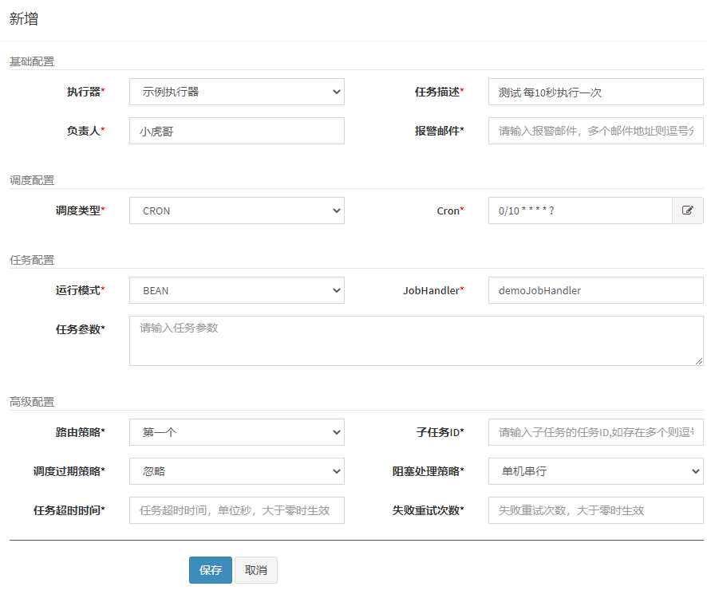

### 一、什么是xxl-job
官网上一句话：*XXL-JOB是一个分布式任务调度平台，其核心设计目标是开发迅速、学习简单、轻量级、易扩展。现已开放源代码并接入多家公司线上产品线，开箱即用。*

简单的说就是特定时间完成特定任务，比如每天早上9:00定时发送营销短信给每个客户。

github源码： [https://github.com/xuxueli/xxl-job](https://github.com/xuxueli/xxl-job)

官方文档：https://www.xuxueli.com/xxl-job/
### 二、SpringBoot单体应用下的任务调度
如果是单体应用可以用SpringBoot自带的任务调度，配置也很简单。如下：

```
// 启动类加上此注解启动任务
@EnableScheduling

// 任务类上加
@Component
// 任务方法上加
@Scheduled(fixedDelay = 3000)
public void fixedDelayScheduled(){
    System.out.println("hello world");
}
```
合适的场景用合适的技术，如果只是简单的单体应用，用SpringBoot自带的完全ok。xxl-job是适合大型的分布式任务调度场景。
### 三、xxl-job 安装
**3.1 初始化数据库脚本**

```
# 脚本位置
/doc/db/tables_xxl_job.sql
```

**3.2 修改配置文件**    
配置文件位置
```
xxl-job-admin/src/main/resources/application.properties
```
主要修改数据库连接信息，数据库账号密码等

```
spring.datasource.url=jdbc:mysql://127.0.0.1:3306/xxl_job?useUnicode=true&characterEncoding=UTF-8&autoReconnect=true&serverTimezone=Asia/Shanghai
spring.datasource.username=root
spring.datasource.password=root_pwd
```


**3.3 Maven编译打包**

```
mvn install '-Dmaven.test.skip=true'
```

打好的jar包位置`/xxl-job-admin/target/xxl-job-admin-2.3.0.jar`


**3.4 运行**

```
# 运行指令
java -jar xxxx.jar
```
访问地址 [http://localhost:8080/xxl-job-admin/toLogin](http://localhost:8080/xxl-job-admin/toLogin)

默认登录账号 admin/123456


### 四、SpringBoot集成xxl-job
源码上有示例代码，在`xxl-job-executor-samples`目录下
`pom.xml`

```xml
<?xml version="1.0" encoding="UTF-8"?>
<project xmlns="http://maven.apache.org/POM/4.0.0" xmlns:xsi="http://www.w3.org/2001/XMLSchema-instance"
         xsi:schemaLocation="http://maven.apache.org/POM/4.0.0 https://maven.apache.org/xsd/maven-4.0.0.xsd">
    <parent>
        <groupId>org.springframework.boot</groupId>
        <artifactId>spring-boot-starter-parent</artifactId>
        <version>2.3.2.RELEASE</version>
        <relativePath/>
    </parent>

    <modelVersion>4.0.0</modelVersion>
    <groupId>com.llh.xxl.job</groupId>
    <artifactId>spring-boot-xxl-job</artifactId>
    <version>1.0.0</version>
    <name>spring-boot-xxl-job</name>

    <properties>
        <java.version>1.8</java.version>
        <project.build.sourceEncoding>UTF-8</project.build.sourceEncoding>
        <project.reporting.outputEncoding>UTF-8</project.reporting.outputEncoding>
        <spring-boot.version>2.3.7.RELEASE</spring-boot.version>
    </properties>

    <dependencies>
        <dependency>
            <groupId>org.springframework.boot</groupId>
            <artifactId>spring-boot-starter-web</artifactId>
        </dependency>

        <dependency>
            <groupId>com.xuxueli</groupId>
            <artifactId>xxl-job-core</artifactId>
            <version>2.3.0</version>
        </dependency>

        <dependency>
            <groupId>org.projectlombok</groupId>
            <artifactId>lombok</artifactId>
            <version>1.18.20</version>
            <scope>provided</scope>
        </dependency>
    </dependencies>

</project>
```
---
`application.properties`

```prop
server.port=8081

xxl.job.admin.addresses=http://127.0.0.1:8080/xxl-job-admin

xxl.job.accessToken=

xxl.job.executor.appname=xxl-job-executor-sample

xxl.job.executor.address=

xxl.job.executor.ip=

xxl.job.executor.port=9999

xxl.job.executor.logpath=/data/applogs/xxl-job/jobhandler

xxl.job.executor.logretentiondays=30

```
---
`XxlJobConfig`类

```java
package com.llh.xxl.job.config;

import com.xxl.job.core.executor.impl.XxlJobSpringExecutor;
import lombok.extern.slf4j.Slf4j;
import org.springframework.beans.factory.annotation.Value;
import org.springframework.context.annotation.Bean;
import org.springframework.context.annotation.Configuration;

@Configuration
@Slf4j
public class XxlJobConfig {

    @Value("${xxl.job.admin.addresses}")
    private String adminAddresses;

    @Value("${xxl.job.accessToken}")
    private String accessToken;

    @Value("${xxl.job.executor.appname}")
    private String appname;

    @Value("${xxl.job.executor.address}")
    private String address;

    @Value("${xxl.job.executor.ip}")
    private String ip;

    @Value("${xxl.job.executor.port}")
    private int port;

    @Value("${xxl.job.executor.logpath}")
    private String logPath;

    @Value("${xxl.job.executor.logretentiondays}")
    private int logRetentionDays;

    @Bean
    public XxlJobSpringExecutor xxlJobExecutor() {
        log.info(">>>>>>>>>>> xxl-job config init.");
        XxlJobSpringExecutor xxlJobSpringExecutor = new XxlJobSpringExecutor();
        xxlJobSpringExecutor.setAdminAddresses(adminAddresses);
        xxlJobSpringExecutor.setAppname(appname);
        xxlJobSpringExecutor.setAddress(address);
        xxlJobSpringExecutor.setIp(ip);
        xxlJobSpringExecutor.setPort(port);
        xxlJobSpringExecutor.setAccessToken(accessToken);
        xxlJobSpringExecutor.setLogPath(logPath);
        xxlJobSpringExecutor.setLogRetentionDays(logRetentionDays);

        return xxlJobSpringExecutor;
    }
}
```
---
`SampleXxlJob`类

```java
package com.llh.xxl.job.job;

import com.xxl.job.core.context.XxlJobHelper;
import com.xxl.job.core.handler.annotation.XxlJob;
import lombok.extern.slf4j.Slf4j;
import org.springframework.stereotype.Component;

import java.time.LocalDateTime;
import java.util.concurrent.TimeUnit;

@Component
@Slf4j
public class SampleXxlJob {
    /**
     * 1、简单任务示例（Bean模式）
     */
    @XxlJob("demoJobHandler")
    public void demoJobHandler() throws Exception {
        log.info("开始执行任务，{}", LocalDateTime.now());

        // 模拟执行任务，比如查询所有用户，给用户发送短信
        for (int i = 0; i < 5; i++) {
            log.info("执行任务： " + i);

            // 有关数据库等操作一定要延迟，否则数据库连接资源会瞬间被占满
            TimeUnit.SECONDS.sleep(1);
        }
    }

    /**
     * 2、分片广播任务
     */
    @XxlJob("shardingJobHandler")
    public void shardingJobHandler() throws Exception {

        // 分片参数
        int shardIndex = XxlJobHelper.getShardIndex();
        int shardTotal = XxlJobHelper.getShardTotal();

        log.info("分片参数：当前分片序号 = {}, 总分片数 = {}", shardIndex, shardTotal);

        // 业务逻辑
        for (int i = 0; i < shardTotal; i++) {
            if (i == shardIndex) {
                log.info("第 {} 片, 命中分片开始处理", i);
            } else {
                log.info("第 {} 片, 忽略", i);
            }
        }

    }
}

```
### 五、测试任务调度
启动Java项目，然后在xxl-job后台**新增任务管理**，内容如下，主要是对应JobHandler和代码中的注解一致。

- Cron可以自己去学一下，很简单
- 高级配置里面可以设置路由策略
---

启动任务后可以在后台看到任务调度日志，这里是每10秒执行一次。


### 六、结语
有问题可以在评论区留言，我们一起进步！

源码地址：[https://github.com/tigerleeli/xiaohuge-blog/tree/master/spring-boot-xxl-job](https://github.com/tigerleeli/xiaohuge-blog/tree/master/spring-boot-xxl-job)

同步微信公众号(还没正式运营)：小虎哥的技术博客

